# Creating a report

1. **Basic report operations**

- Display Type Area: Select a chart or control according to business needs, and double-click its icon to create a new chart. Click the icon to replace the selected chart or control.
- Content Configuration Area: Edit the title of the selected chart or control; set data and the filter; and adjust the style. With advanced configuration, carry out the multi-chart association to fulfill data linkage analysis.
- Layout and Content Design Area: Adjust the position of a chart by dragging. Select “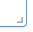” in the bottom right corner of the chart to adjust its size;
- Overall Report Operation Area: Enter the name of a report in Chinese or English; select Save, Save As, Report Preview or Publish.

  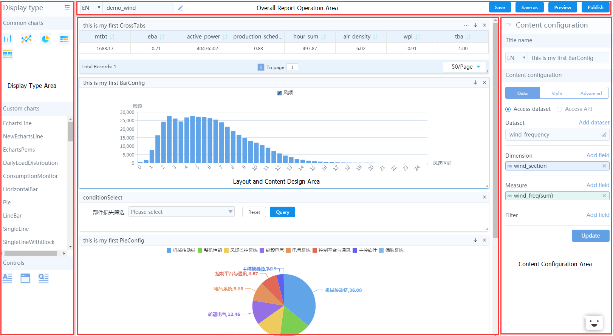

2. **New/switch charts and controls**

  Double-click the chart or control icon in the "Display Type Area" on the left, and a new chart will be automatically displayed in the "Layout and Content Design Area". Click the icon to replace the selected chart or control.

  The reporting platform provides four kinds of universal charts (bar chart, line chart, pie chart, cross table and indicating block ) and three controls (query, text box and iFrame). It supports custom charts imported from the EnOS System. To understand how to operate with charts and controls, please refer to **Charting**.

  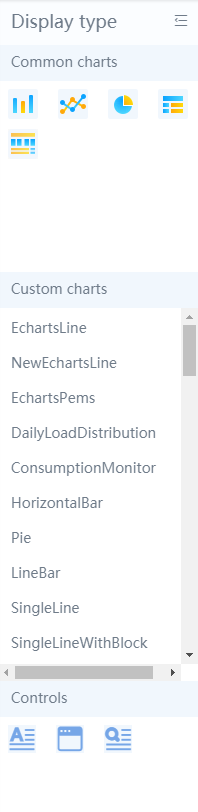

3. **Data configuration**

  Select a chart to modify its title in the "Content Configuration Area" on the right. The reporting platform supports Chinese and English title names. Please note that only Chinese titles are displayed in the Chinese language environment and only English titles displayed in the English language environment.

  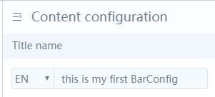

  Once the data configuration is completed, Click **"Update"**, and the system will draw a chart based on your settings.

  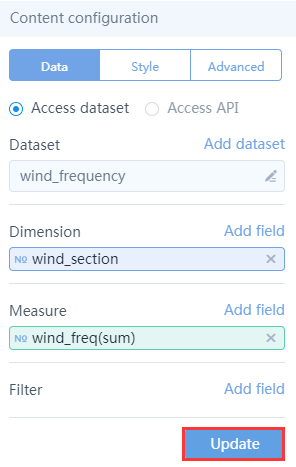

- **Select dataset**

  The reporting platform supports two methods for data access: "Access Dataset" and "Access API".

  Select the "Access Dataset" mode, click "Add Dataset" and select or search for the target dataset from the drop-down menu.

  If the desired dataset cannot be found in the drop-down menu, return to the Data Set Management page where the desired dataset may be created. See **Dataset Management**.

  To modify the selected dataset, click the "Small Pen" button on the right to be redirected to the "Edit Dataset" page.

  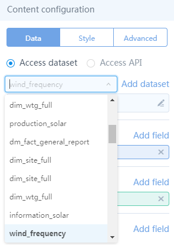

	"Access API" is designed for developers to obtain data and create analysis charts on a custom interface. The following contents are required:

- Requested URL
- Request method
- Headers
- Request parameters
- Response result processing
- Horizontal axis (dimension)
- Vertical axis (measure)

  Click **"Update"**, and the system will draw a chart based on your settings.

  Set Request Parameters depending on the user's different interface conditions. Relevant key values in the returned data should be completed in the horizontal axis (dimension) and vertical axis (measure).

  Please note that the following instructions when selecting the Access API:

- The interface must be in the ENVISION domain. Cross-domain is not currently supported.
- The Json format is supported in the horizontal axis (dimension) and vertical axis (measure). For example:

  {"Dimension_key": "dimension_value", "measure_key": "measure_value"}

  The key value corresponding to the horizontal axis (dimension) is "dimension_key", and corresponding to the vertical axis (measure), "measure_value".

  For example:

  [{"Wind turbine model": "EN87/1.5", “generating capacity": "1.5MW"}, {"Wind turbine model": "EN121/2.0", “generating capacity": "2.0MW"}]

  Fill "Wind Turbine Model" in the horizontal axis (dimension) key, and fill “Generating Capacity” in the vertical axis (measure) key.

- Response result processing:

  If the data format returned from an interface does not meet requirements, you can customize a function in the response result processing, to carry out data processing. The format prefix is /$eval/$/$content/$/$scope/$/$, directly followed by the contents of the function. Finally, the data format meeting the requirements must be returned.

  “eval” identifies and converts a custom processing function to an expression and executes the function;

  “content” can be used to get the return value of ajax request;

  “scope” is the pointer “this” of the function currently being executed.

- Headers:

  Fill in the headers. Only the Json format is supported.

- Request parameters:

  Fill in the request parameters. Only the Json format is supported.

  The example of Json format is as follows:

  {a: "hello", b: "world"}, or {"a": "hello", "b": "world"}

  The following provides an example of Access API. Now select "Bar chart", and then carry out data configuration as shown below:

  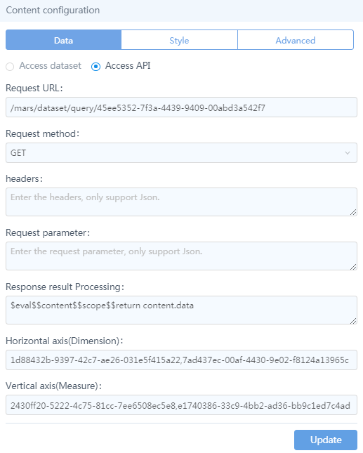

  Click Update, and the generated chart is as follows:

  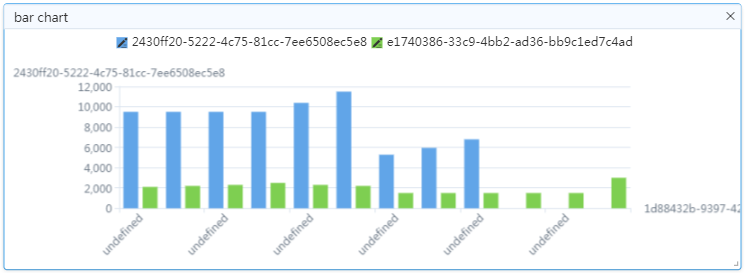

- **Select dimension and measure**

  Select a dataset to configure its dimensions and measures. Click “Add Field” to select or search for a dimension or a measure name. To delete a selected field, click "×" on the right of the field.

  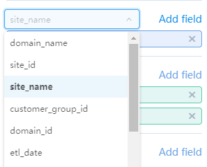

  If multiple dimensions or measures are configured, the fields order can be dragged.

  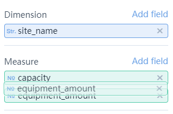

  During dataset editing, set the default aggregation mode for each "measure”. To make a chart, "Measures” will aggregate as per the selected “Dimension” field before displaying the processed data.

  It should be noted that different charts come with different aggregatable numbers of dimensions and measures. Please see **Charting** for details.

4. **Set filter**

  If you have a large amount of data, choose the filter function that helps filter out one or more types of data you need from a dataset.

  Click “Add Field” to select or search for a field name to be filtered out. To delete a filtered field, click "×" on the right of the field.

  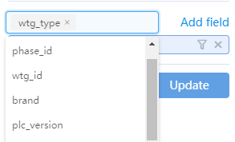

  Let's take the field “wtg_type” as an example. When setting filter conditions, first click on the "Screen" symbol on the right of the field name and the dialog shown below will pop up. In the four filtering conditions - Equal to, Not Equal to, Fuzzy Matching and Fuzzy Mismatch, select “Equal to" and input the filtering value "EN110/2.3". Click OK to complete filter settings. Finally, click "Update", and the chart will update its data according to the filter conditions.

  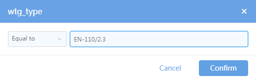

  When there are multiple filter values, separate them with commas. For numeric filter items, the filter conditions include: Equal to, Not Equal to, Larger than, Large than or Equal to, Smaller than, Smaller than or Equal to, and Between.

5. **Style configuration**

  On the Style tab, set a display style for the selected chart. Let's take the following bar chart as an example for describing how to configure a style. To configure a style for other types of charts or controls, please see **Charting**.

  First create or select a bar chart, and complete data configuration.

  Click "Style" and select the style of bar chart. You may also set the horizontal axis title, vertical axis title (spindle) and slave axis title (slave axis, empty by default) in English or Chinese.

  When the data access method is "Access API" and there is a need to refresh data in real time, you can set an auto refresh time. By default, the system does no  refresh them. The shortest refresh time supported is 5 seconds.

  The system also supports Show/Hide Legend, and Adjust Legend Position.

  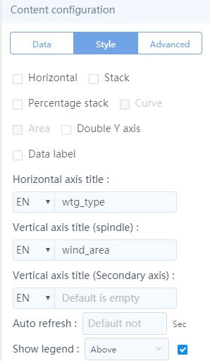

  Let's take the "Horizontal" effect of a bar chart as an example for illustrating style configuration renderings.

  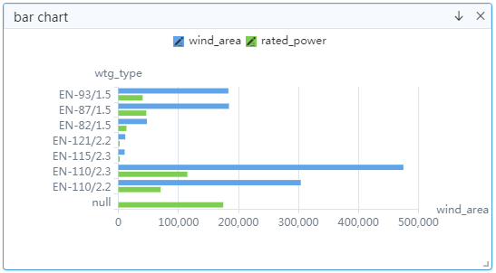

6. **Advanced configuration (multi-chart association configuration)**

  When multiple charts exist and there is an associable "dimension" between charts, you can make "advanced configuration" to associate multiple charts:

- Select a chart, such as bar chart; click the **"Advanced Configuration"** tab;
- In the **"Advanced Configuration"** tab, the system automatically displays the associable chart information;

  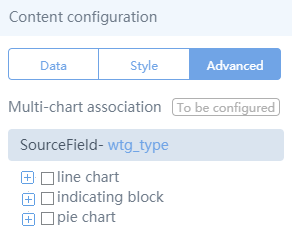

- Based on the source field information, select the same associated fields in selectable charts;

  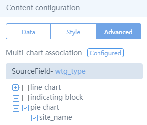

- Click on associated dimensions in the charts, to achieve the linkage between multiple charts.
- To cancel the "Multi-Chart Association” effects, simply cancel the selected **"Multi-Chart Association"**.

7. **Delete chart**

  To delete a chart, just click to select the "x" button in the upper right corner of the chart.

  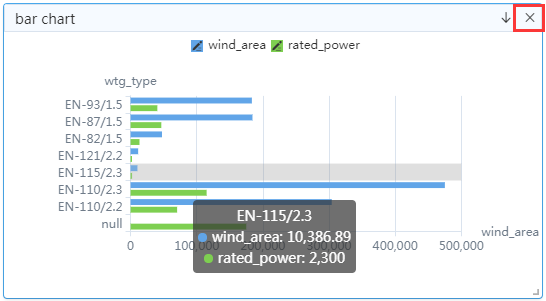

8. **Download chart data**

  Click to select the "↓" button in the upper right corner of the chart, to download details in CSV format to the local position.

  You can also download the details by clicking the "↓" button in the upper right corner of the chart on the "Preview" page.

  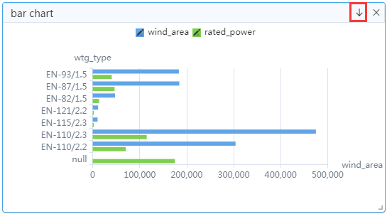

9. **Adjust layout and size**

  To adjust the position of each chart block, just drag the title bar of a chart.To adjust the size of a chart, drag the “” icon in its lower right corner of the chart.

  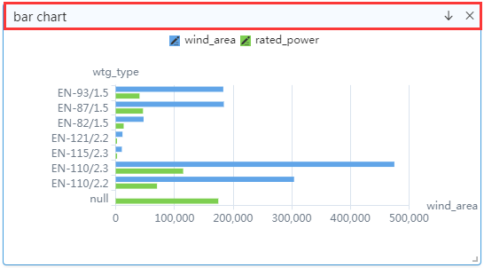

10. **Preview and publish a report**

  After completing the report design, you can perform **"Save"**, **"Save As"**, **"Preview"**, and **"Publish"** operations on a report.

  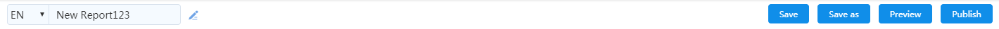

- Save: Save an edited report.
- Save As: Enter a new report name to generate a copy of the current report.
- Preview: Once the current report is saved, click "Preview” to preview the current report in a new page. A cross table supports up to 100,000 lines of data.
- Publish: Select “Public" or “Visible to Owner Only" depending on your needs. Once it is published, click "Copy Report Address” so as to enter a link in your browser to access the published report.

  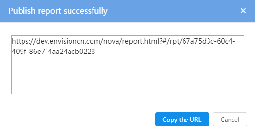

  In particular after editing, users can perform **“Save As”** and **“Republish”** operations to published reports.

  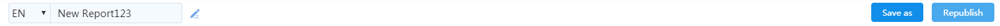
