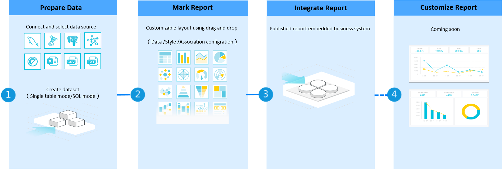

# BI&Report overview

EnOS BI & Report is a lightweight commercial intelligence analysis product based upon the EnOS IoT platform and oriented to the energy sector. It aims to lower the threshold for user data analysis and to quickly complete visual presentation.

Primarily intended for data analysts and developers, BI & Report provides users with full lifecycle products and supports from data source connection and dataset generation to data report visualization, operation system inserts as a whole or independent portals. Users can quickly build data analysis reports through interactive drag-and-drop operation. Its reporting platform helps lower the cost and threshold for users to acquire, process and analyze data, thereby avoiding duplicate efforts in front-end development.

## Key benefits

The built-in BI&report function of EnOS brings the following benefits:

- **Seamless data integration**: seamlessly integrates EnOS cloud databases and supports multiple data sources such as MySQL and postgreSQL;
- **Components**: seamlessly interface with EnOS energy component libraries to provide abundant data visualization charts and controls that meet visualization requirements for different business scenarios;
- **Page integration**: quickly become integrated into the EnOS built-in front-end framework or business portal for rapid creation of data portals;
- **Security**: provide control over data security on the basis of the platform’s sound IAM authority system.

## Key concepts

The basic objects in a reporting platform include data sources, datasets and reports, as described below:

- **Data source**: Before making a report, it is necessary to prepare data or rather specify the data source where raw data is located. The reporting platform automatically associates to corresponding data sources according to your permissions in the EnOS System. The type of data sources supported by the current version is MySQL. For more details about data source contents, see [Data source management](https://docs.eniot.com/docs/offline-data/en/latest/data_source/datasource_overview.html).

- **Dataset**: Once a data source is connected, simple logic processing based on one data source table or more can get a logic table that has a connection to the source table, namely, “a dataset”. It can be quoted directly in the report design session. Users no longer need to care about any logic processing of underlying data table beyond report design. For more details about dataset contents, see **Dataset Management**.

- **Report**: Your report contents can be customized in a WYSIWYG way by dragging the chart design layout according to business needs. A report may contain a variety of analysis charts and controls. Filtering, multi-chart association and other advanced operations are allowed. For more details about report contents, see **Make Report**.

	
