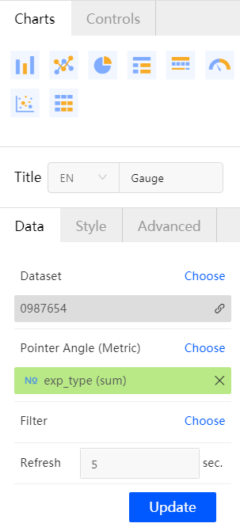
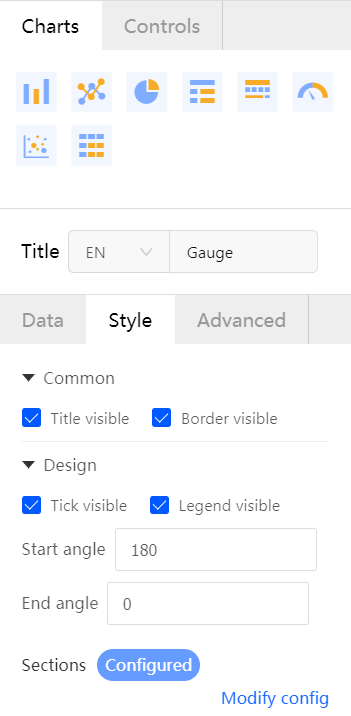
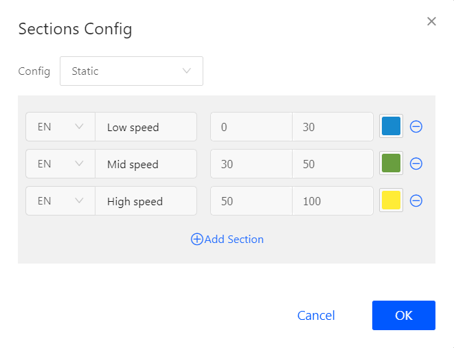

# Gauge

Gauge can clearly show the range of a certain index value and intuitively indicate whether the value is in the controllable range or the current completion progress of a task.

Gauge consists of a pointer angle and board. The pointer angle is specified by the measure data and the setting interval.

## Configuration

Gauge supports 0 dimension and 1 measure.

Before creating a report, you must have datasets created. Take the following steps to configure settings for the gauge.

1. Log in EnOS Console and select **BI & Report** > **Reports** > **New Report** to open the report editing page.

2. Double-click the **Gauge** icon . The gauge template is added to the report display section.

3. Under the **Data** tab, select a dataset to be used from the drop-down list of the **Dataset** field.

4. From the drop-down list of the **Pointer Angle** field, select the measure data field to be used for the gauge.

5. Click the **Update** button. The gauge will be refreshed to display the selected data.

   **Note**: The data configuration will take effect only after you click the **Update** button.

6. If you want to set a data filter, see **How to set data filter for a report** in the [FAQ section](../report_faq).

7. To set automatic data refresh, enter an interval value in the **Refresh** field. The minimum value supported is 5 seconds.

   

8. After data configuration is completed, you can set the layout of the gauge under the **Style** tab, including **Common** and **Design** configuration. The style settings take effect in real time.

   - Checkbox for displaying title

   - Checkbox for displaying border

   -  Checkbox for displaying the tick marks

   - Checkbox for displaying the legend

   - Setting of the start angle and end angle (180° and 0° by default)

   - Configuring data value sections

     

9. There are 2 options for configuring data value sections, static and dynamic. For the dynamic option, you must have datasets created. The measure fields represent the start and end values of a section. For the static option, take the following steps to configure data value sections:

   - Click **Add Section**.

   - Enter the section name (supporting Chinese, English, and special characters with a limit of 50)

   - Enter the start and end value of the section. The start value must be less than the end value.

   - Select a color for the section.

   - Click **OK**.

     

10. Gauge does not support multi-chart association.

11. To view the chart data or download data, click theicon in the upper right corner of the chart and click **View data** > **Download**. Optionally, click **Delete** to delete the chart.

12. After all configuration is completed, click **Save** in the tool bar to save the chart.