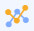
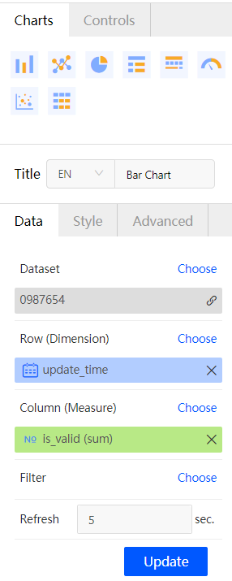
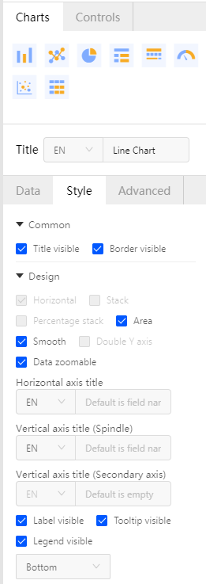

# Line Chart

Line chart is often used to show the trend of data and continuous data changing with time. It is useful in analyzing and displaying the trend of data in the same time intervals. Line chart can also be used to analyze the interaction and impact of multiple sets of data over time, for example, analyzing the change of electricity generation every month.

## Configuration

Line chart supports 1 dimension and 1 or multiple measures.

Before creating a report, you must have datasets created. Take the following steps to configure settings for the line chart.

1. Log in EnOS Console and select **BI & Report** > **Reports** > **New Report** to open the report editing page.

2. Double-click the **Line chart** icon . The line chart template is added to the report display section.

3. Under the **Data** tab, select a dataset to be used from the drop-down list of the **Dataset** field.

4. From the drop-down list of the **Row (Dimension)** and **Column (Measure)** fields, select the corresponding data fields to be used for the line chart.

5. Click the **Update** button. The line chart will be refreshed to display the selected data.

   **Note**: The data configuration will take effect only after you click the **Update** button.

6. If you want to set a data filter, see **How to set data filter for a report** in the [FAQ section](../report_faq).

7. To set automatic data refresh, enter an interval value in the **Refresh** field. The minimum value supported is 5 seconds.

   

8. After data configuration is completed, you can set the layout of the line chart under the **Style** tab, including **Common** and **Design** configuration. The style settings take effect in real time.

   - Checkbox for displaying title

   - Checkbox for displaying border 

   - Style settings for the line chart, including horizontal, stack, percentage stack, area, smooth, double Y axis, and zoom. 

     **Note**: Only if there are more than 2 measures, the setting of double Y axis are supported.

   - Titles for the horizontal axis and vertical axis, supporting Chinese, English, and special characters with a limit of 50.

   - Checkbox for displaying data label

   - Checkbox for displaying tooltip

   - Settings for the position of legend (Top, Bottom, Left, or Right). 

     

9. After style configuration is completed, you can set multi-chart association under the **Advanced** tab.

10. In the report display section, you can configure the display effect of dimension and measures by clicking on the legend, including the title, chart type, axis, content, and color.

11. To view the chart data or download data, click theicon in the upper right corner of the chart and click **View data** > **Download**. Optionally, click **Delete** to delete the chart.

12. After all configuration is completed, click **Save** in the tool bar to save the chart.