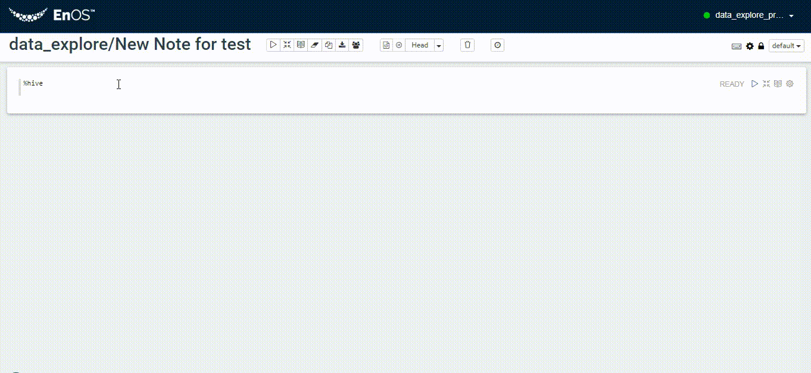

# Getting started with Data Explorer

A typical flow to use Data Explorer to explorer data is as follows:

### Step1: Create a new note
- Click "New note"
- Enter "Name" and "Type". You can choose any "Type", programs' run-time is not limited to it
- Go to this note and begin your work  

### Step2: Coding in a paragraph and running with interpreter
- The interpreters we have already supported are as blow:
  hive, spark, markdown, mysql, python, Shell
- Use percent specified interpreter:
  <body>
  <table border="1" cellspacing="0" cellpadding="0" width="798">
  <tr>
    <td><strong>Interpreter</strong></td>
    <td><strong>Using method</strong></td>
  </tr>
  <tr>
    <td>hive</td>
    <td valign="top">%hive</td>
  </tr>
  <tr>
    <td>spark</td>
    <td valign="top">%livy.spark</td>
  </tr>
  <tr>
    <td>pyspark</td>
    <td valign="top">%livy.pyspark</td>
  </tr>
  <tr>
    <td>markdown</td>
    <td valign="top">%md</td>
  </tr>
  <tr>
    <td>mysql</td>
    <td valign="top">%mysql_report</td>
  </tr>
  <tr>
    <td>python</td>
    <td valign="top">%python</td>
  </tr>
  <tr>
    <td>shell</td>
    <td valign="top">%sh</td>
  </tr>
</table>
</body>

### Step3: Data visualization
- Choose the basic charts to assistant you to analysis, such as: table, Bar Chart, Pie Chart, Area Chart, Line Chart, Scatter Chart.  

  Take the content of a certain column "education" as a group, then count the data volume under each group. Also you can switch to another group such as "job" or "age" or "marital". As follows:  

  
