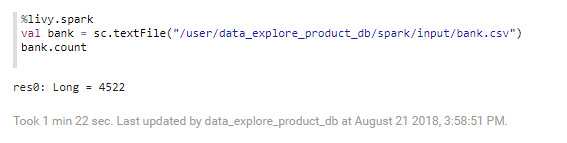
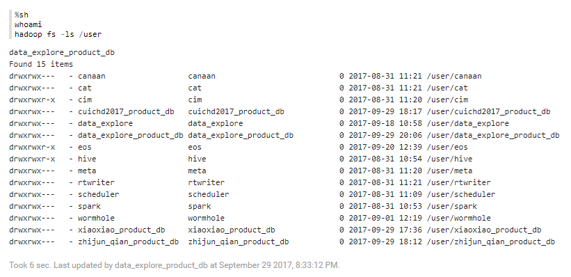

# Interpreter Supported

#### %hive

Example1: Show you how to use hql to query a table raw data.
```sql
%hive
select * from bank limit 10;
```
Click button "run this paragraph", then result is as blow.


#### %livy.spark
Example2: Read file "bank.csv" and count the number of rows.
```
%livy.spark
val bank = sc.textFile("/user/data_explore_product_db/spark/input/bank.csv")
bank.count
```


#### %livy.pyspark
Example3:
```
```

#### %md
Example4: Supports markdown syntax.
```markdown
%md
# hello world
- **hello world**
```


#### %mysql_report
Access the database of BI&Report.  

Example5:
```sql
%mysql_report
select * from bank limit 10;
```


Example6:
```sql
%mysql_report
select ${group_by}, count(1)as count, avg(balance)as balance_avg
from bank
where marital="${marital=single,single|divorced|married}" and age < ${maxAge=50}
group by ${group_by=education,education|job|age|marital};
```


#### %python
Example7: Show the fundamental operation of python, mark two coordinate points.
```python
%python
import matplotlib.pyplot as plt
z.configure_mpl(width=400, height=300, fmt='svg')
plt.plot([1,2,3,4], [1,4,9,16], 'ro')
```


#### %sh
Example8: Show the fundamental operation of shell.
```
%sh
whoami
hadoop fs -ls /user
```

