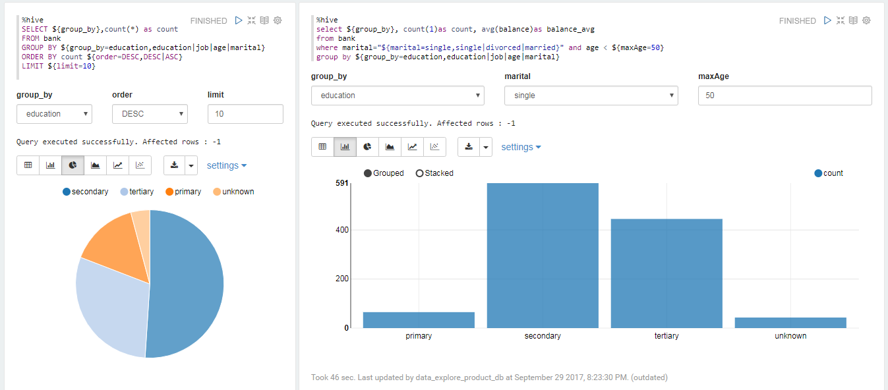

# Data Explorer

## Overview

Data Explorer is designed to support flexible data analysis scenarios, it's based on the open source project "Apache Zeppelin" which is a web-based notebook that enables data-driven, interactive data analytics and collaborative documents with SQL, Scala and more.

Data Explorer helps developers, data scientists and relevant user roles process data more efficiently without having to use complex command lines or caring about clustering implementation details.

## Key benefits

- **Data Discovery & Analytics**: Data Explorer supports multiple languages, you can easy to write the queries or processes to transform your data and extract valuable insights.

- **Data Visualization & Collaboration**: Some basic charts are already included in it, such as histogram, pie chart, line chart, scatter chart, etc. Visualizations are not limited to SparkSQL query, any output from any language backend can be recognized and visualized.

## Key concepts

- **Interpreter**: A gateway connecting specific back-end framework to run actual code. We have already supported many interpreters such as Apache Spark, Python, JDBC, Markdown and Shell.

- **Paragraph**: The minimum unit to be executed with specified interpreter.

- **Note**: A set of paragraphs. A note can bind multiple interpreters.
